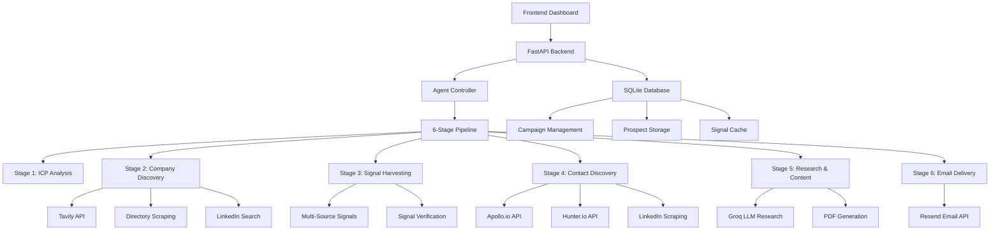
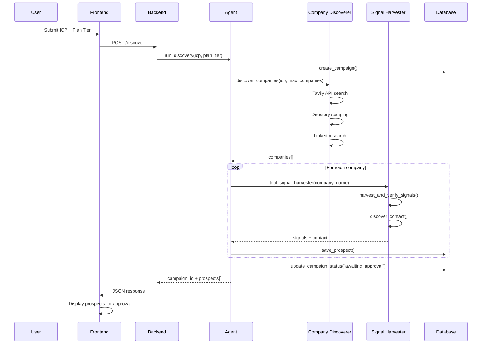
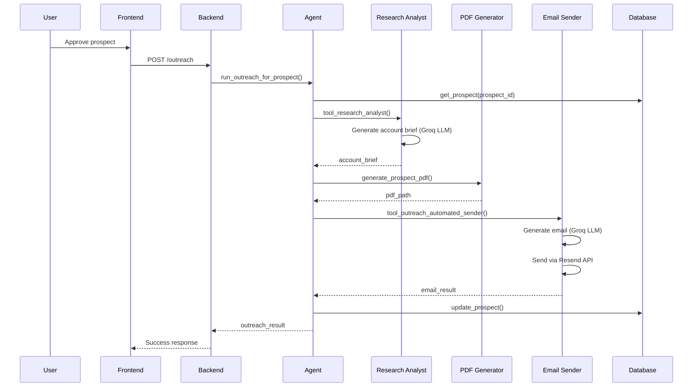

# Design Document: FireReach Autonomous Outreach Engine

## Overview

FireReach is a comprehensive autonomous outreach engine that automates the complete SDR (Sales Development Representative) workflow from prospect discovery to personalized email delivery. The system implements a 6-stage pipeline that discovers companies matching an Ideal Customer Profile (ICP), harvests buying signals, researches prospects, generates personalized content, and sends targeted outreach emails with PDF attachments.

The system addresses the core challenge of scaling personalized B2B outreach by combining real-time company discovery, multi-source signal harvesting, AI-powered research analysis, and automated email generation. Built with FastAPI backend and modern SaaS frontend, it supports tiered plans (Free: 3 companies, Pro: 10, Enterprise: 25) and integrates with multiple data sources including Tavily API, Apollo.io, Hunter.io, and LinkedIn scraping.

## Architecture



## Sequence Diagrams

### Main Discovery Flow



### Outreach Execution Flow



## Components and Interfaces

### Agent Controller

**Purpose**: Orchestrates the complete 6-stage outreach pipeline

**Interface**:
```python
def run_discovery(icp: str, plan_tier: str) -> dict:
    """Stages 1-3: Discover companies, harvest signals, score them"""
    pass

def run_outreach_for_prospect(prospect_id: int, icp: str, fallback_email: str = "") -> dict:
    """Stages 4-6: Contact discovery, research, email generation and sending"""
    pass
```

**Responsibilities**:
- Campaign lifecycle management
- Pipeline stage coordination
- Error handling and recovery
- Database state management

### Company Discoverer

**Purpose**: Multi-source company discovery matching ICP criteria

**Interface**:
```python
def discover_companies(icp: str, max_companies: int = 3) -> List[Dict]:
    """Discover actual companies using multiple data sources"""
    pass

def discover_via_tavily(icp: str, max_companies: int) -> List[Dict]:
    """Use Tavily API for recent company news and funding"""
    pass

def discover_via_directories(icp: str, max_companies: int) -> List[Dict]:
    """Scrape startup directories and company lists"""
    pass

def discover_via_linkedin_search(icp: str, max_companies: int) -> List[Dict]:
    """Search LinkedIn for companies"""
    pass
```

**Responsibilities**:
- Real-time company discovery via Tavily API
- Startup directory scraping (AngelList, Crunchbase, Y Combinator)
- LinkedIn company search
- Duplicate removal and relevance filtering

### Signal Harvester

**Purpose**: Harvests and verifies S1-S6 buying signals with multi-source contact discovery

**Interface**:
```python
def tool_signal_harvester(company_name: str, designation: str = "") -> dict:
    """Main entry point for signal harvesting and contact discovery"""
    pass

def harvest_and_verify_signals(company_name: str) -> dict:
    """Harvest S1-S6 signals with verification"""
    pass

def discover_contact(company_name: str, designation: str) -> dict:
    """Multi-source contact discovery: Apollo → Hunter → LinkedIn → Website"""
    pass
```

**Responsibilities**:
- S1-S6 signal detection and verification
- Multi-source contact discovery (Apollo.io, Hunter.io, LinkedIn, website scraping)
- Signal scoring and confidence assessment
- Contact data enrichment

### Research Analyst

**Purpose**: Generates targeted account briefs using LLM analysis

**Interface**:
```python
def tool_research_analyst(company: str, signals: list, icp: str, contact: dict) -> dict:
    """Generate precise account brief using Groq LLM"""
    pass
```

**Responsibilities**:
- Account brief generation using verified signals
- ICP-signal connection analysis
- Pain point identification
- Professional GTM analyst tone

### Email Sender

**Purpose**: Generates personalized emails and sends via Resend API

**Interface**:
```python
def tool_outreach_automated_sender(account_brief: str, signals: list, contact: dict, company: str, pdf_path: str = "") -> dict:
    """Generate and send personalized outreach email with PDF attachment"""
    pass
```

**Responsibilities**:
- Personalized email generation using Groq LLM
- PDF attachment handling
- Email delivery via Resend API
- Delivery status tracking

### PDF Generator

**Purpose**: Creates professional prospect one-pagers

**Interface**:
```python
def generate_prospect_pdf(company: str, contact: dict, signals: list, account_brief: str, icp: str) -> str:
    """Generate PDF one-pager for prospect"""
    pass
```

**Responsibilities**:
- Professional PDF layout generation
- Signal visualization
- Contact information formatting
- File management and cleanup

## Data Models

### Campaign Model

```python
class Campaign:
    id: int
    created_at: datetime
    icp: str
    plan_tier: str  # "free", "pro", "enterprise"
    max_companies: int
    companies_found: int
    companies_approved: int
    companies_sent: int
    status: str  # "discovering", "awaiting_approval", "completed", "failed"
```

**Validation Rules**:
- ICP must be non-empty string
- Plan tier must be one of: "free", "pro", "enterprise"
- Max companies determined by plan tier (3, 10, 25)

### Prospect Model

```python
class Prospect:
    id: int
    campaign_id: int
    created_at: datetime
    company_name: str
    business_summary: str
    website: str
    signals: List[Signal]
    high_confidence_count: int
    target_designation: str
    signal_score: int  # 0-100
    approval_status: str  # "pending", "approved", "skipped"
    contact_name: str
    contact_email: str
    contact_title: str
    contact_source: str  # "apollo", "hunter", "linkedin_scraping", "website"
    account_brief: str
    email_subject: str
    generated_email: str
    pdf_path: str
    send_status: str  # "pending", "sent", "failed"
```

**Validation Rules**:
- Company name must be 3-50 characters
- Signal score must be 0-100
- Email must be valid format when present

### Signal Model

```python
class Signal:
    type: str  # "S1_HIRING", "S2_FUNDING", "S3_TRAINING", "S4_AI_AGENTS", "S5_PRODUCT_LEAD", "S6_EXPANSION"
    signal: str  # First sentence of discovered content
    source_url: str
    confidence: str  # "HIGH", "MEDIUM", "LOW"
    verified_by: str  # "second_source", "single_source"
    score: int  # Signal-specific scoring (15-35 points)
```

**Validation Rules**:
- Type must be one of the 6 defined signal types
- Confidence must be HIGH, MEDIUM, or LOW
- Signal text must be under 300 characters

### Contact Model

```python
class Contact:
    name: str
    email: str
    title: str
    linkedin_url: str
    company_domain: str
    phone: str
    source: str  # "apollo", "hunter", "linkedin_scraping", "website_scraping", "user_provided"
```

**Validation Rules**:
- Email must be valid format when present
- Source must be one of the defined discovery methods

## Algorithmic Pseudocode

### Main Discovery Algorithm

```pascal
ALGORITHM runDiscovery(icp, planTier)
INPUT: icp (string), planTier (string)
OUTPUT: discoveryResult (object)

BEGIN
  ASSERT icp IS NOT EMPTY AND planTier IN ["free", "pro", "enterprise"]
  
  // Initialize campaign
  maxCompanies ← getPlanLimit(planTier)
  campaignId ← createCampaign(icp, planTier)
  
  // Stage 1: Company Discovery
  companies ← discoverCompanies(icp, maxCompanies)
  
  IF companies IS EMPTY THEN
    updateCampaignStatus(campaignId, "failed")
    RETURN {status: "failed", error: "No companies found"}
  END IF
  
  // Stage 2-3: Signal Harvesting and Scoring
  prospects ← []
  FOR each company IN companies DO
    ASSERT company.name IS VALID
    
    harvestedData ← toolSignalHarvester(company.name)
    
    prospectData ← {
      companyName: company.name,
      businessSummary: company.businessSummary,
      website: company.website,
      signals: harvestedData.signals,
      highConfidenceCount: harvestedData.highConfidenceCount,
      targetDesignation: harvestedData.targetDesignation,
      signalScore: harvestedData.signalScore
    }
    
    prospectId ← saveProspect(campaignId, prospectData)
    prospects.ADD(prospectData WITH id: prospectId)
  END FOR
  
  updateCampaignStatus(campaignId, "awaiting_approval")
  
  ASSERT prospects.length > 0
  
  RETURN {
    campaignId: campaignId,
    status: "awaiting_approval",
    planTier: planTier,
    maxCompanies: maxCompanies,
    prospects: prospects
  }
END
```

**Preconditions**:
- ICP is non-empty string describing target customer profile
- Plan tier is valid ("free", "pro", "enterprise")
- Database connection is available
- External APIs (Tavily, Apollo, Hunter) are accessible

**Postconditions**:
- Campaign is created in database with unique ID
- All discovered companies have been processed for signals
- Prospects are saved with signal scores and contact information
- Campaign status is set to "awaiting_approval" or "failed"
- Return object contains campaign ID and prospect list

**Loop Invariants**:
- All processed companies have valid names and signal data
- Prospect count never exceeds maxCompanies limit
- Database remains in consistent state throughout processing

### Signal Harvesting Algorithm

```pascal
ALGORITHM harvestAndVerifySignals(companyName)
INPUT: companyName (string)
OUTPUT: signalResult (object)

BEGIN
  ASSERT companyName IS NOT EMPTY
  
  // Generate search queries for different signal types
  queries ← [
    companyName + " hiring engineers security AI 2025",
    companyName + " funding raised series 2025", 
    companyName + " training program requirements 2025",
    companyName + " AI agents automation 2025",
    companyName + " product lead expansion launch 2025"
  ]
  
  rawSignals ← []
  
  // Search for signals using Tavily API
  FOR each query IN queries DO
    searchResult ← tavilyClient.search(query, maxResults: 3)
    
    FOR each item IN searchResult.results DO
      snippet ← item.content[0:300]  // First 300 characters
      
      IF snippet IS EMPTY THEN
        CONTINUE
      END IF
      
      // Match against signal keywords
      matchedType ← NULL
      FOR each signalType IN SIGNALS DO
        IF ANY keyword IN signalType.keywords MATCHES snippet THEN
          matchedType ← signalType
          BREAK
        END IF
      END FOR
      
      IF matchedType IS NOT NULL THEN
        signal ← {
          type: matchedType.name,
          signal: snippet.firstSentence(),
          sourceUrl: item.url,
          confidence: "UNVERIFIED",
          score: matchedType.score
        }
        rawSignals.ADD(signal)
      END IF
    END FOR
  END FOR
  
  // Deduplicate by signal type
  deduplicatedSignals ← removeDuplicatesByType(rawSignals)
  
  // Verify each signal with second search
  verifiedSignals ← []
  FOR each signal IN deduplicatedSignals DO
    verifyQuery ← companyName + " " + signal.type + " " + signal.signal[0:50]
    verifyResult ← tavilyClient.search(verifyQuery, maxResults: 2)
    
    // Check for corroboration from different source
    sourceDomain ← extractDomain(signal.sourceUrl)
    corroborated ← FALSE
    
    FOR each verifyItem IN verifyResult.results DO
      verifyDomain ← extractDomain(verifyItem.url)
      IF verifyDomain ≠ sourceDomain AND verifyItem.url ≠ signal.sourceUrl THEN
        corroborated ← TRUE
        signal.verifiedBy ← verifyItem.url
        BREAK
      END IF
    END FOR
    
    IF corroborated THEN
      signal.confidence ← "HIGH"
    ELSE
      signal.confidence ← "MEDIUM"
      signal.verifiedBy ← "single_source"
    END IF
    
    verifiedSignals.ADD(signal)
  END FOR
  
  // Filter and score
  filteredSignals ← FILTER verifiedSignals WHERE confidence IN ["HIGH", "MEDIUM"]
  SORT filteredSignals BY (confidence = "HIGH" ? 0 : 1)
  finalSignals ← filteredSignals[0:5]  // Top 5 signals
  
  totalScore ← MIN(SUM(signal.score FOR signal IN finalSignals), 100)
  
  // Determine primary designation
  primaryDesignation ← ""
  IF finalSignals IS NOT EMPTY THEN
    topSignalType ← finalSignals[0].type
    primaryDesignation ← SIGNALS[topSignalType].designations[0]
  END IF
  
  ASSERT totalScore >= 0 AND totalScore <= 100
  
  RETURN {
    signals: finalSignals,
    highConfidenceCount: COUNT(s WHERE s.confidence = "HIGH" IN finalSignals),
    signalSummary: [s.signal FOR s IN finalSignals],
    signalScore: totalScore,
    targetDesignation: primaryDesignation
  }
END
```

**Preconditions**:
- Company name is non-empty string
- Tavily API client is initialized and accessible
- SIGNALS configuration is properly defined
- Network connectivity is available

**Postconditions**:
- Returns verified signals with confidence levels
- Signal score is between 0-100
- High confidence count accurately reflects verified signals
- Target designation is determined from highest-scoring signal

**Loop Invariants**:
- All signals maintain valid type and confidence values
- Raw signals list never contains duplicates of same type
- Verification process maintains signal integrity

### Contact Discovery Algorithm

```pascal
ALGORITHM discoverContact(companyName, designation)
INPUT: companyName (string), designation (string)
OUTPUT: contactResult (object)

BEGIN
  ASSERT companyName IS NOT EMPTY
  
  // Step 1: Apollo.io API (primary source)
  apolloContact ← discoverViaApollo(companyName, designation)
  IF apolloContact.email IS NOT EMPTY THEN
    apolloContact.source ← "apollo"
    RETURN apolloContact
  END IF
  
  // Step 2: Hunter.io API (fallback)
  hunterContact ← discoverViaHunter(companyName, designation)
  IF hunterContact.email IS NOT EMPTY THEN
    hunterContact.source ← "hunter"
    RETURN hunterContact
  END IF
  
  // Step 3: LinkedIn scraping (enhanced)
  linkedinContact ← discoverViaLinkedInScraping(companyName, designation)
  IF linkedinContact.email IS NOT EMPTY OR linkedinContact.linkedinUrl IS NOT EMPTY THEN
    linkedinContact.source ← "linkedin_scraping"
    RETURN linkedinContact
  END IF
  
  // Step 4: Company website scraping
  websiteContact ← discoverViaWebsiteScraping(companyName, designation)
  IF websiteContact.email IS NOT EMPTY THEN
    websiteContact.source ← "website_scraping"
    RETURN websiteContact
  END IF
  
  // Step 5: Social media discovery
  socialContact ← discoverViaSocialMedia(companyName, designation)
  IF socialContact.email IS NOT EMPTY THEN
    socialContact.source ← "social_media"
    RETURN socialContact
  END IF
  
  // No contact found
  RETURN {
    name: "",
    email: "",
    title: "",
    linkedinUrl: "",
    companyDomain: "",
    phone: "",
    source: "not_found"
  }
END
```

**Preconditions**:
- Company name is valid and non-empty
- Designation parameter is provided (may be empty)
- API keys for Apollo and Hunter are configured
- Network connectivity is available

**Postconditions**:
- Returns contact with source attribution
- Email format is validated when present
- Contact source accurately reflects discovery method
- Returns empty contact object if no contact found

**Loop Invariants**:
- Contact discovery follows priority order (Apollo → Hunter → LinkedIn → Website → Social)
- First successful contact discovery terminates the search
- Source field always matches the successful discovery method

## Key Functions with Formal Specifications

### Function 1: run_discovery()

```python
def run_discovery(icp: str, plan_tier: str) -> dict
```

**Preconditions:**
- `icp` is non-empty string describing target customer profile
- `plan_tier` is one of: "free", "pro", "enterprise"
- Database connection is available and initialized
- External APIs (Tavily, Apollo, Hunter) are accessible

**Postconditions:**
- Returns dictionary with campaign_id, status, and prospects list
- If successful: `result["status"] == "awaiting_approval"`
- If failed: `result["status"] == "failed"` with error message
- Campaign is persisted in database with unique ID
- All discovered prospects are saved with signal scores

**Loop Invariants:**
- Company processing count never exceeds plan tier limit
- Database remains in consistent state during processing
- All processed companies have valid signal data

### Function 2: harvest_and_verify_signals()

```python
def harvest_and_verify_signals(company_name: str) -> dict
```

**Preconditions:**
- `company_name` is non-empty string (3-50 characters)
- Tavily API client is initialized with valid API key
- SIGNALS configuration dictionary is properly defined

**Postconditions:**
- Returns dictionary with verified signals and confidence levels
- `result["signal_score"]` is integer between 0-100
- `result["signals"]` contains max 5 highest-scoring signals
- All returned signals have confidence "HIGH" or "MEDIUM"

**Loop Invariants:**
- Signal verification maintains original signal integrity
- Confidence levels are accurately assigned based on corroboration
- Signal scores sum to maximum of 100 points

### Function 3: discover_contact()

```python
def discover_contact(company_name: str, designation: str) -> dict
```

**Preconditions:**
- `company_name` is non-empty string
- `designation` parameter is provided (may be empty string)
- Apollo and Hunter API keys are configured
- Network connectivity is available

**Postconditions:**
- Returns contact dictionary with source attribution
- If contact found: `result["email"]` contains valid email format
- If no contact found: `result["source"] == "not_found"`
- Source field accurately reflects discovery method used

**Loop Invariants:**
- Contact discovery follows priority order without skipping
- First successful discovery terminates the search process
- Contact data integrity is maintained throughout discovery

## Example Usage

```python
# Example 1: Complete discovery workflow
icp = "We sell cybersecurity training to Series B startups"
plan_tier = "pro"

# Run discovery pipeline
result = run_discovery(icp, plan_tier)

if result["status"] == "awaiting_approval":
    print(f"Campaign {result['campaign_id']} created")
    print(f"Found {len(result['prospects'])} prospects")
    
    # Approve and run outreach for first prospect
    prospect_id = result["prospects"][0]["id"]
    outreach_result = run_outreach_for_prospect(prospect_id, icp)
    
    if outreach_result["status"] == "sent":
        print(f"Email sent to {outreach_result['recipient']}")

# Example 2: Signal harvesting
company_name = "TechFlow Solutions"
signals_result = harvest_and_verify_signals(company_name)

print(f"Found {len(signals_result['signals'])} signals")
print(f"Signal score: {signals_result['signal_score']}/100")
print(f"High confidence: {signals_result['high_confidence_count']}")

# Example 3: Contact discovery
contact = discover_contact("TechFlow Solutions", "CTO")
if contact["email"]:
    print(f"Found contact: {contact['name']} - {contact['email']}")
    print(f"Source: {contact['source']}")
```

## Correctness Properties

### Universal Quantification Properties

**Property 1: Campaign Integrity**
```
∀ campaign ∈ Campaigns: 
  campaign.max_companies = getPlanLimit(campaign.plan_tier) ∧
  campaign.companies_found ≤ campaign.max_companies ∧
  campaign.status ∈ {"discovering", "awaiting_approval", "completed", "failed"}
```

**Property 2: Signal Verification**
```
∀ signal ∈ VerifiedSignals:
  signal.confidence ∈ {"HIGH", "MEDIUM"} ∧
  signal.type ∈ {"S1_HIRING", "S2_FUNDING", "S3_TRAINING", "S4_AI_AGENTS", "S5_PRODUCT_LEAD", "S6_EXPANSION"} ∧
  (signal.confidence = "HIGH" ⟹ signal.verified_by ≠ "single_source")
```

**Property 3: Contact Discovery Priority**
```
∀ contact ∈ DiscoveredContacts:
  contact.source ∈ {"apollo", "hunter", "linkedin_scraping", "website_scraping", "social_media", "not_found"} ∧
  (contact.email ≠ "" ⟹ isValidEmail(contact.email)) ∧
  (contact.source = "apollo" ⟹ ¬∃ higher_priority_source)
```

**Property 4: Prospect Scoring**
```
∀ prospect ∈ Prospects:
  0 ≤ prospect.signal_score ≤ 100 ∧
  prospect.signal_score = min(∑(signal.score for signal in prospect.signals), 100) ∧
  prospect.high_confidence_count = |{s ∈ prospect.signals : s.confidence = "HIGH"}|
```

**Property 5: Pipeline State Consistency**
```
∀ campaign ∈ Campaigns:
  (campaign.status = "completed" ⟹ campaign.companies_sent > 0) ∧
  (campaign.status = "awaiting_approval" ⟹ campaign.companies_found > 0) ∧
  (campaign.companies_approved ≤ campaign.companies_found) ∧
  (campaign.companies_sent ≤ campaign.companies_approved)
```

## Error Handling

### Error Scenario 1: API Rate Limiting

**Condition**: External APIs (Tavily, Apollo, Hunter) return rate limit errors
**Response**: Implement exponential backoff with jitter, cache results to reduce API calls
**Recovery**: Retry failed requests after backoff period, use cached data when available

### Error Scenario 2: No Companies Found

**Condition**: Company discovery returns empty results for given ICP
**Response**: Update campaign status to "failed", provide specific error message
**Recovery**: Suggest ICP refinement, offer alternative search strategies

### Error Scenario 3: Signal Harvesting Failure

**Condition**: Tavily API unavailable or returns no signal data
**Response**: Log error, continue with empty signals list, mark confidence as "LOW"
**Recovery**: Retry signal harvesting in background, use cached signals if available

### Error Scenario 4: Contact Discovery Failure

**Condition**: All contact discovery methods fail to find valid contact
**Response**: Save prospect with empty contact fields, allow manual email input
**Recovery**: Provide fallback email option, suggest LinkedIn manual search

### Error Scenario 5: Email Delivery Failure

**Condition**: Resend API fails to deliver email
**Response**: Update send_status to "failed", preserve generated content
**Recovery**: Allow manual retry, provide email content for manual sending

## Testing Strategy

### Unit Testing Approach

**Core Components Testing**:
- Signal harvesting with mock Tavily responses
- Contact discovery with mock API responses  
- Email generation with mock LLM responses
- Database operations with test database
- PDF generation with sample data

**Test Coverage Goals**:
- 90%+ code coverage for core business logic
- 100% coverage for data validation functions
- Edge case testing for API failures and empty responses

### Property-Based Testing Approach

**Property Test Library**: Hypothesis (Python)

**Key Properties to Test**:
1. **Signal Score Bounds**: `0 ≤ signal_score ≤ 100` for all generated prospects
2. **Email Format Validation**: All discovered emails pass regex validation
3. **Campaign State Transitions**: Valid state transitions in campaign lifecycle
4. **Contact Discovery Priority**: Apollo results preferred over Hunter when both available
5. **Signal Deduplication**: No duplicate signal types per company

**Example Property Test**:
```python
@given(st.text(min_size=1, max_size=50))
def test_signal_score_bounds(company_name):
    result = harvest_and_verify_signals(company_name)
    assert 0 <= result["signal_score"] <= 100
    assert result["high_confidence_count"] <= len(result["signals"])
```

### Integration Testing Approach

**End-to-End Pipeline Testing**:
- Complete discovery workflow with test ICP
- Outreach execution with test prospect data
- Database persistence and retrieval
- Email generation and mock sending

**API Integration Testing**:
- Tavily API with real queries (rate-limited)
- Apollo/Hunter APIs with test accounts
- Resend API with test email addresses

## Performance Considerations

**Company Discovery Optimization**:
- Parallel API calls to Tavily, directories, and LinkedIn
- Result caching with 24-hour TTL
- Intelligent query batching to minimize API calls

**Signal Harvesting Performance**:
- Concurrent signal searches across multiple queries
- Signal verification batching
- Database caching of verified signals per company

**Contact Discovery Efficiency**:
- Priority-based discovery (Apollo → Hunter → LinkedIn)
- Early termination on first successful contact
- Contact data caching with company association

**Database Performance**:
- Indexed queries on campaign_id and company_name
- JSON field optimization for signals storage
- Connection pooling for concurrent requests

**Memory Management**:
- Streaming PDF generation for large documents
- Cleanup of temporary files after email sending
- Efficient JSON serialization for API responses

## Security Considerations

**API Key Management**:
- Environment variable storage for all API keys
- No hardcoded credentials in source code
- Secure key rotation procedures

**Data Privacy**:
- No storage of sensitive personal information beyond business contacts
- GDPR-compliant data retention policies
- Secure deletion of prospect data on request

**Email Security**:
- SPF/DKIM configuration for email authentication
- Rate limiting to prevent spam classification
- Unsubscribe link inclusion in all emails

**Input Validation**:
- SQL injection prevention through parameterized queries
- XSS protection in frontend forms
- Email format validation before sending

**Access Control**:
- Plan tier enforcement for company limits
- Campaign ownership validation
- Secure session management

## Dependencies

**Core Backend Dependencies**:
- FastAPI: Web framework and API routing
- SQLite: Database for campaign and prospect storage
- Groq: LLM API for research analysis and email generation
- Resend: Email delivery service
- Tavily: Real-time search and company discovery

**Data Source APIs**:
- Apollo.io: Professional contact database
- Hunter.io: Email finder and verification
- LinkedIn: Company and contact discovery (scraping)

**Python Libraries**:
- httpx: HTTP client for API requests
- python-dotenv: Environment variable management
- reportlab: PDF generation
- sqlite3: Database connectivity

**Frontend Dependencies**:
- Vanilla HTML/CSS/JavaScript (no framework dependencies)
- Font Awesome: Icons and UI elements
- Inter Font: Typography

**Development Dependencies**:
- pytest: Unit testing framework
- hypothesis: Property-based testing
- black: Code formatting
- uvicorn: ASGI server for development